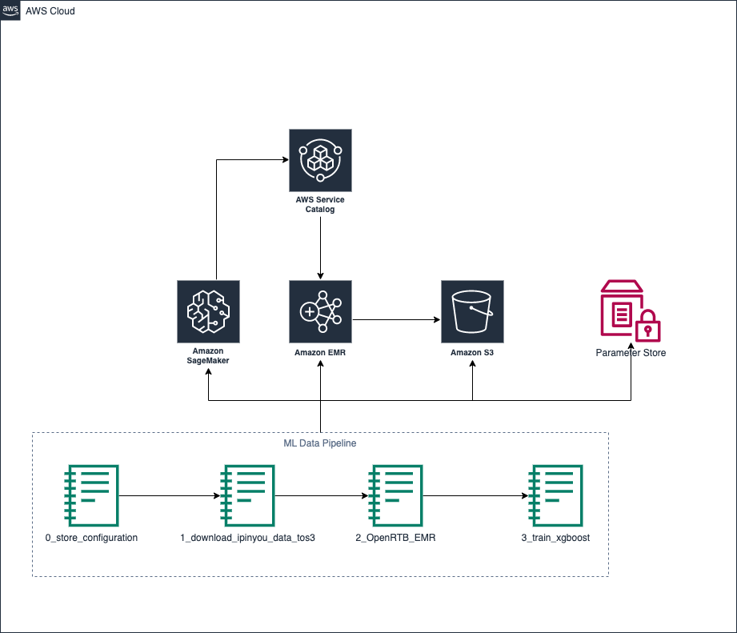
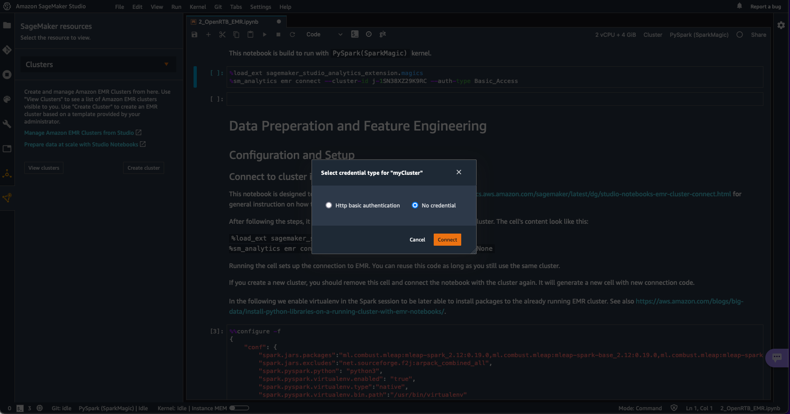
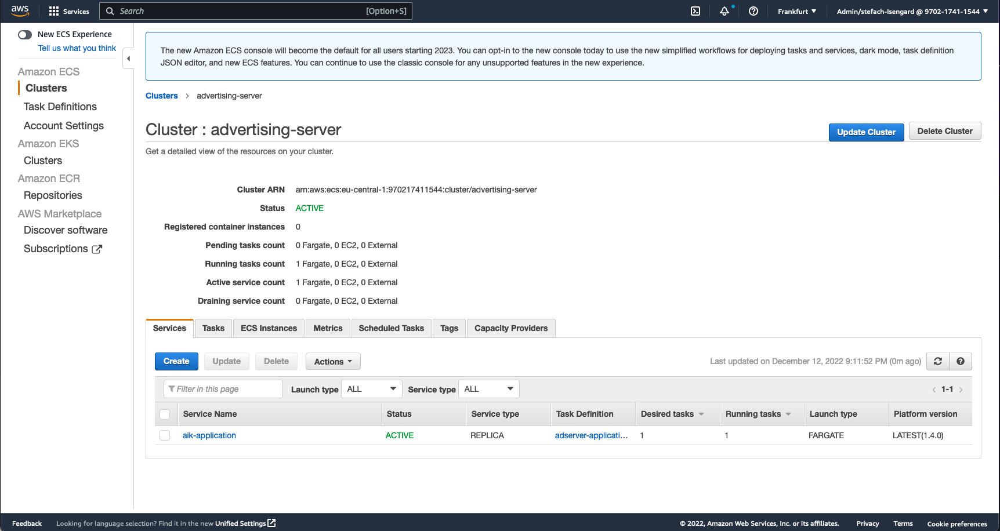

## Introduction

### What is this repository about?

Many customers in the programmatic advertising - or adtech - industry have huge data volumes and requirements for low latency inference models. While the heart of a machine learning pipeline - training models and tracking performance - has become easier with services like Amazon SageMaker Studio in the last few years, data scientists still find challenges with ingesting and transforming ever-growing big data (>TB) as well as creating very low latency (<10ms) models. The RTB Intelligent Kit is a framework with familiar use cases to address these challenges.

With one CDK application, a data scientist can deploy an end-to-end pipeline with pre-configured use cases, and can adapt the Kit to their particular needs. The Kit includes:

* sample public data in OpenRTB format
* a data transformation pipeline using EMR
* an ML environment including SageMaker Studio
* a deployment of containerized inference models for integration into customer platforms at low latency

The pre-configured use case at launch is bid filtering - predicting the likelihood of a bidder to make a bid on a given bid request. The pipeline is easily adaptable to other use cases common in the industry. By launching the Kit as an open source project, users can contribute back their own adaptations and implementations in this growing industry.

## Support

If you notice a defect, have questions, or need support with deployment, please create an issue in this repository.

## Prerequisites

* No Amazon SageMaker Domain in your Account as the Kit installs a new domain. You can only have one domain per account and region.
* [kaggle](https://www.kaggle.com/) a Kaggle account to download the example data set into the Kit

If you want to build this solution on your local environment, you will need to install these prerequisites:

* [Node.js](https://nodejs.org/en/) with version higher than 10.13.0 (Please note that version between 13.0.0 and 13.6.0 are not compatible too)
* [CDK](https://docs.aws.amazon.com/cdk/v2/guide/getting_started.html#getting_started_prerequisites) with version higher than 2.5.0
* [Docker](https://docs.docker.com/get-docker/) version 20

Alternatively, you can build this solution in the AWS Cloud. For that, you will only need:

* an AWS Account with a granted permission to deploy CloudFormation stacks.

## Architecture

The overall architecture is depicted below and consists of three major components:

1. ML Pipeline Component: Downloading & preparing of the data, feature engineering and training of the ML model
2. Data Repository: Holding all the data and generated artifacts
3. Filtering Server Component: Showcasing the usage of an ML Model for traffic filtering.


### ML - Data Pipeline

The Data and ML training pipeline is implemented as a series of Amazon SageMaker Studio Notebooks, which should be run in sequence to execute all the pipeline steps. For processing of big volumes of bidding and impression data it is utilizing an EMR cluster, which is instantiated from Amazon SageMaker Studio.



### Filtering Server Component

The trained model is showcased in a traffic filtering use case where a bidding server is using the model inference to make bid / no-bid decisions based on the models prediction. All involved components are deployed as individual container in an Amazon ECS cluster.


## Deployment

### Cloud-powered deployment

You can deploy this Kit into your Account leveraging such services as AWS CloudFormation and AWS CodeBuild without needing to install the dependencies locally.
Please note that additional charges will apply, as this approach involves [bootstrapping a separate CDK environment](https://docs.aws.amazon.com/cdk/v2/guide/bootstrapping.html), running a [CodeBuild build](https://aws.amazon.com/codebuild/pricing/), and executing multiple AWS Lambda functions.

This Kit consists of two CDK stacks. You will deploy both in the same way, just providing different stack URLs. After deploying the first part, continue with running the Kit. When you will need to deploy the **inference part** of the Kit, refer back to this deployment guide again.

#### Using AWS Management Console

1. Navigate to the CloudFormation console.
2. Choose **Create stack** - **Template is ready** - **Amazon S3 URL**.
3. Enter the *Amazon S3 Url* of the stack you want to deploy:
    * ML part: **TODO: URL HERE**
    * Inference part: **TODO: URL HERE**
4. Click **Next**.
5. Enter the *Stack name*, for example, **RTB-Kit-MLDataPipeline** or **RTB-Kit-Inference**. Keep the parameter **CDKQUALIFIER** with its default value.
6. Click **Next**.
7. Add tags if desired and click **Next**.
8. Scroll down to the bottom, check **I acknowledge that AWS CloudFormation might create IAM resources** and click **Submit**.
9. Wait until the stack is successfully deployed. There will be several additional stacks created.

After deploying the Kit, continue to [Run the solution](#run-the-solution). If you decided to build the Kit locally, continue with [Install](#install) instead.

#### Using AWS CLI

1. Make sure your AWS CLI credentials are configured for your AWS Account and the target region.
2. Run the following command, changing the `--stack-name` argument if desired:
    * ML part:

**Linux/MAC:**

```bash
    ML_STACK="$(mktemp)" && curl -Ss  ***TODO: ML DATA PIPELINE URL HERE*** -o $ML_STACK

    aws cloudformation create-stack --template-body file://$ML_STACK \
        --parameters ParameterKey=CDKQUALIFIER,ParameterValue=rtbkit \
        --capabilities CAPABILITY_IAM --stack-name RTB-Kit-MLDataPipeline
```

**Windows:**


```bash
    set ML_STACK=%TMP%\aws-rtb-kit-ml.json && curl -Ss ***TODO: ML DATA PIPELINE URL HERE*** -o %ML_STACK%

    aws cloudformation create-stack --template-body file://%ML_STACK%^
        --parameters ParameterKey=CDKQUALIFIER,ParameterValue=rtbkit^
        --capabilities CAPABILITY_IAM --stack-name RTB-Kit-MLDataPipeline
```

* Inference part:


**Linux/MAC:**

```bash
    INFERENCE_STACK="$(mktemp)" && curl -Ss ***TODO: INFERENCE URL HERE*** -o $INFERENCE_STACK

    aws cloudformation create-stack --template-body file://$INFERENCE_STACK \
        --parameters ParameterKey=CDKQUALIFIER,ParameterValue=rtbkit \
        --capabilities CAPABILITY_IAM --stack-name RTB-Kit-Inference
```

**Windows:**

```bash
    set INFERENCE_STACK=%TMP%\aws-rtb-kit-inference.json && curl -Ss  ***TODO: INFERENCE URL HERE*** -o %INFERENCE_STACK%

    aws cloudformation create-stack --template-body file://%INFERENCE_STACK%^
        --parameters ParameterKey=CDKQUALIFIER,ParameterValue=rtbkit^
        --capabilities CAPABILITY_IAM --stack-name RTB-Kit-Inference
```

After deploying the Kit, continue to [Run the solution](#run-the-solution). If you decided to build the Kit locally, continue with [Install](#install) instead.

### Install

First, clone this repository into your development environment. We recommend AWS Cloud9 as a development environment, which contains all required dependencies listed above.

To clone the repository

```bash
git clone https://github.com/aws-samples/aws-rtb-intelligence-kit
```

Then, in your terminal, navigate to the root of the cloned directory

```bash
cd aws-rtb-intelligence-kit
```

In order to install this module's dependencies, use the following command.

```bash
npm install
```

### Build

In order to build the CDK modules part of this repository and compile the Typescript code, use the following command.

```bash
npm run build
```

### Deploy the RTB Intelligence Kit

For a standalone deployment, run the following commands.

> Note that you will need the AWS CDK installed.

First of all you need to bootstrap your CDK to be able to deploy the Kit into your Account.

```bash
cdk bootstrap
```

Then we deploy the components of the Kit, which are used to run the data processing and the ML model training, with the following command:

```bash
cdk deploy "aik/sagemaker-emr" --require-approval never
```

Running this command deploys:

* an Amazon SageMaker Studio Domain, with a user which you will be using later to run data processing and ML trainings
* a Service Catalog Product which allows you to instantiate an EMR cluster from the SageMaker Studio workbench. You will be using the EMR cluster to run the actual data processing of the raw data

After those steps we are ready to use the Kit.

## Run the solution

### Open SageMaker Studio and create the EMR cluster

The first step is to open Amazon SageMaker Studio. For this you navigate to the SageMaker service within the AWS Management Console. Then click on **Control panel** link on the left hand side.

You will find the SageMaker Domain with the prepared user. Go ahead an open SageMaker Studio for this user as illustrated in the screenshot below. You find more detailed instructions in the [Amazon SageMaker Developer Guide](https://docs.aws.amazon.com/sagemaker/latest/dg/configure-service-catalog-templates-studio-walkthrough.html).


Now we can go and create the EMR Cluster which we will be using for data processing.

> :warning: Note that the running EMR Cluster is charged regardless of whether it is actually in use. So make sure to terminate it if it is not necessary anymore.

The cluster can easily be created from within SageMaker Studio. Open SageMaker resources by clicking on the orange triangle icon on the left pane. Then click on Projects, select Clusters in the dropdown menu. Click on Create cluster. It will open another tab.


Select **Clusters** and click on **Create cluster**. It will open another tab.

In the **Select template** step, select `SageMaker EMR Product` template. This template was created earlier by your CDK deployment.


Enter any value for `EmrClusterName`. Leave other fields with default values.


The creation of the cluster takes some time, but **we can proceed with the next steps while waiting**.

> Note that you can terminate the cluster from the same user interface and recreate the cluster at any point in time. This helps you to control the cost of running the Kit.

### Clone the GitHub repo

As a last preparation step, we clone the GitHub repo to obtain the Notebooks for running the Data Processing and ML model training. Click on the **Git icon** on the left hand side. Then select **Clone a Repository** button.

Use the clone url of this GitHub repository: <https://github.com/aws-samples/aws-rtb-intelligence-kit.git>.


As a result, you will have a local copy of the GitHub repository in your SageMaker Studio Environment. Open the `aws-rtb-intelligence-kit/source/notebooks` directory on the File Browser tab in SageMaker Studio to find the notebook files. We will use these notebooks in the following steps. In particular we have the following notebooks:

* `0_store_configuration.ipynb`
* `1_download_ipinyou_data_tos3.ipynb`
* `2_OpenRTB_EMR.ipynb`
* `3_train_xgboost.ipynb`

### Run the data processing Pipeline

In the following we run through the individual steps of the pipeline. Each of the steps is provided as a notebook which are extensively documented. Therefore we are only providing the highlights here. You can find the notebook files in the `aws-rtb-intelligence-kit/source/notebooks` directory.

In general the notebooks are desigend to be run with `Python 3 (Data Science)` kernel. The exception of this rule is `2_OpenRTB_EMR.ipynb` which is utilizing a `PySpark (SparkMagic)` kernel. Detailed instruction on how to change the kernel for a SageMaker Notebook can be found in the [Amazon SageMaker Developer Guide](https://docs.aws.amazon.com/sagemaker/latest/dg/notebooks-create-open.html#notebooks-open)

#### Setting up the environment

As a firsts step we are setting up the environment with the `0_store_configuration.ipynb` notebook. For this purpose we pick up the data bucket name, which has been created during the deployment from the Systems Manager Parameter store. We use it to generate the various prefixes for organizing the different artefacts we generate in the S3 bucket. We store those prefixed in the Parameter Store to later use them in the different steps of the pipeline.

#### Downloading the raw data

In order to bootstrap our project, we are using a dataset which is available on the Kaggle website. `1_download_ipinyou_data_tos3.ipynb` takes you through the required steps to download the data into the prepared S3 bucket. For this purpose you need a Kaggle Account which can be created on their website. The intention is to get the solution end to end working with this example dataset prior to introducing your own data which will require some adoptions depending on the details of the data format you are using.

#### Preprocessing the data and feature engineering

The preprocessing and feature engineering steps will be involving large amounts of data - especially in real life scenarios. In order to be able to process the data, we will be running it on the Amazon EMR Cluster which we have been creating already in an earlier step. The notebook runs within a PySpark (SparkMagic) kernel and will be connected to the EMR cluster.

The screenshots below are showing how you can connect your notebook to the EMR cluster. First click on cluster.


The next step is selecting the EMR cluster from the list of available clusters.


Now we can select the **No credentials** option and continue with **Connect** as outlined in the screenshot below.



We are setup and can run the data processing pipeline.

The actual pipeline is all contained in `2_OpenRTB_EMR.ipynb` and documented inline the notebook.

### Train the machine learning model

Now as we have prepared the features which will be used to train the machine learning model, we can now train our first model. The model training is done by executing the `3_train_xgboost.ipynb`notebook which contains extensive inline documentation.

At the end of this notebook we will save our XGBoost binary model in S3, which is then used for inference in the following steps.

### Run the inference

The next step is to deploy the inference part of the Kit.

If you have built the Kit locally, use the following command to deploy the inference part:

```bash
cdk deploy "aik/filtering" --require-approval never
```

Otherwise (if you preferred the Cloud-powered approach), refer to the [Cloud-powered deployment](#cloud-powered-deployment) section and follow the instructions to deploy the inference part.

As you can see in the architecture diagram below, the inference is composed of one ECS cluster and one tasks and a CloudWatch dashboard.


#### Overview of deployed tasks in ECS

Once the CDK stacked is deployed, you can visit the [ECS console](https://console.aws.amazon.com/ecs). You see the cluster created as described below


Once you have clicked on the `advertising-server` cluster, you should have a similar view:


Now, if you select the `tasks` tab, you can see the ECS task managed by the service


The task should be in a `running` status. If you clicked on the task id, you would see the detail of your task.


As you can see in image, the ECS task is composed of three containers. The first container is named the `filtering-server`. The role of this service is to listen for bid request and generate a likelihood based on three artifacts generated at the [previous step](#run-the-data-processing-pipeline):

1. An XGBoost model written in binary format. The model is stored on S3 bucket. The URI is passed to the filtering through an SSM parameter `/aik/xgboost/path`.
2. A pipeline model packaged as a [MLeap bundle](https://combust.github.io/mleap-docs/). The package is stored on an S3 bucket. The URI is passed to the filtering server through an SSM parameter `/aik/pipelineModelArtifactPath`.
3. An Schema in JSON format representing the format of the input data of the pipeline. The JSON file is stored on an S3 bucket. The URI is passed to the filtering server through an SSM parameter `/aik/pipelineModelArtifactSchemaPath`.

The second container is named the `advertising-server`. Its role is to emulate an ad server, to send bid request and then to receive a likelihood. This container generates 500000 bid requests from set of bid requests generated at [previous step](#run-the-data-processing-pipeline). The requests are stored as [JSON lines](https://jsonlines.org/examples/) in a file. The file is stored on an S3 bucket. The URI is passed to the filtering server through an SSM parameter `/aik/inference_data`. The last container run the CloudWatch agent. Its role is to receive any metrics produce by one of the two first containers and send them to a [CloudWatch dashboard](https://console.aws.amazon.com/cloudwatch/#dashboards:name=Monitoring-Dashboard).

#### Introduction to the CloudWatch dashboard


The description starts from left to right.

The first widget displays the latency (the 99th percentile over the last 10 seconds) of the likelihood computation. There are two latencies:

1. The latency from the filtering client. This metrics is important because it is directly related to the latency experienced by an ad server.
2. The second metric represents the latency from the filtering server. This metric is important because it shows that most of the time is spent in computation only.

The second widget represents the per second throughput of filtering request. The throughput is an average computed over a period of ten second.

The third widget represents the likelihood to bid (average over the last 10 seconds). This metric is important because is allows the user to monitor the quality of the likelihood computed.

The fourth widget represents the number of bid request processed during the last 5 minutes.

## How to load a new trained Model for inference

Loading a new model is as simple as restarting a new ECS task.

Please go the [ECS console](https://console.aws.amazon.com/ecs):


Please click on `advertising-server` to view cluster details:


Please click on the `tasks` tab to view the running tasks:


Select the running task and click on the `Stop` button:


You will be warned that the task might be configured to automatically restart. Actually this is the case. The task will be restarting with the new configuration and updated model.

Follow the instructions printed on the user interface.

After a few minutes, a new ECS task will be running. The new task will automatically load the latest model generated.

## 🔰 Description

### Advertising Intelligence Stack

The infrastructure can be divided in two main parts:

* Sagemaker construct managing the Sagemaker domain, VPC, subnet, roles, and security groups.
* A service catalog product stack that allows Sagemaker users to provision an EMR cluster
* A cluster running a bidding application (emulation of an ad server) and a sidecar for filtering the bid request.

## ❄ Outputs for the Advertising Intelligence Kit

### SSM Parameters

The `aik/filtering` infrastructure create parameters in [AWS Parameter Store](https://docs.aws.amazon.com/systems-manager/latest/userguide/systems-manager-parameter-store.html). Those parameters can be used by other services.

Parameter Variable                          | Description
--------------------------------------------| ------------
`/aik/monitoring/config`     | The CloudWatch configuration for the metrics

### CloudWatch Metrics

Once the stack is deployed and the filtering application running, cloud watch metrics are created.

Namespace| Dimension(Key)| Dimension(Value) | metric name  | Description
---------|---------------|------------------|--------------|-------------
aik      | metric_type   | gauge            | adserver_client_likelihood_to_bid   | likelihood to bid
aik      | metric_type   | timing           | adserver_client_adserver_latency_ms | observed latency on client side for getting the likelihood to bid
aik      | metric_type   | timing           | filtering_server_filtering_latency  | observed latency on server side for getting  the likelihood to bid
aik      | metric_type   | counter          |filtering_server_filtering_count     | number of bid requests submitted

### Cleanup

Follow these instructions to remove the Kit from your Account.

1. Delete EMR clusters created by SageMaker user
    1. Terminate any cluster you have created as outlined in [Amazon SageMaker Developer Guide](https://docs.aws.amazon.com/sagemaker/latest/dg/configure-service-catalog-templates-studio-walkthrough.html).
2. Delete the SageMaker Studio Domain. Detailed instructions can be found in [Amazon SageMaker Developer Guide](https://docs.aws.amazon.com/sagemaker/latest/dg/gs-studio-delete-domain.html). It involves the following steps:
    1. Delete the SageMaker Studio Applications
    2. Delete the SageMaker Studio User
    3. Delete the SageMaker Studio Domain
    4. Delete the Elastic File System created by SageMaker
3. Delete parameters from Parameter store
4. If you deployed the Kit from your local environment, run the following commands:

    ```sh
    cdk destroy "aik/filtering"
    cdk destroy "aik/sagemaker-emr"
    ```

5. If you deployed the Kit using the Cloud-powered approach, delete the  Kit deployment CloudFormation stacks you created (**RTB-Kit-MLDataPipeline** and **RTB-Kit-Inference**). This will also delete the Kit stacks as well. Finally, delete the CDK bootstrapping stack **CDKToolkit-rtbkit**.
    * Delete the stacks using AWS Management Console
    * Alternatively, use AWS CLI:

        ```sh
        aws cloudformation delete-stack --stack-name RTB-Kit-MLDataPipeline
        aws cloudformation delete-stack --stack-name RTB-Kit-Inference
        aws cloudformation delete-stack --stack-name CDKToolkit-rtbkit
        ```
